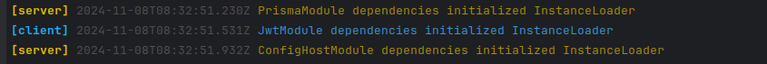
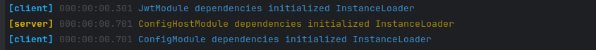
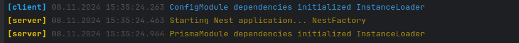
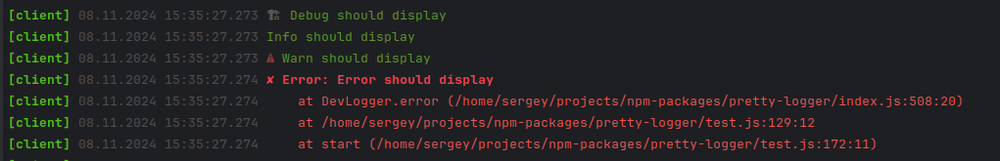

# Development Logger

Outputs logs of several running threads to one console, separating them in different colors. There is support for interpolation and output of javascript objects. Displays the time from the start of the service.


## Installation

```shell
npm install -D devel-logger
```

## Usage

### Import logger class and create logger instance.

Since the logger is designed to work as part of several instances at once, the configuration fields that define the source are required. These are 'prefix' and 'color'.

```typescript
import { DevLogger } from 'devel-logger';

const Logger = new DevLogger({
  // 'color' and 'prefix' fields is required.
  color: 'cyan',      
  prefix: 'SERVER',
  
  // This values used as default.
  logLevel: 'info',
  icons: true, 
  override: (line: string) => line, 
  timeFormat: 'relative',
});

Logger.info('Hello World');

// This message will not be displayed because logLevel = 'info'
Logger.debug('Debug message');

```

### Logger configuration

- `color` - Supported colors "green", "yellow", "blue", "magenta", "cyan". The red color is reserved for errors.
- `prefix` - Logger prefix. Required.
- `logLevel` - Supported values "silence", "info", "warn", "error", "debug". By default is used "info".
- `icons` - Disable/Enable level icons.
- `override` - Callback function. Called each line, you can override output, or skip line if returns false.
- `timeFormat` - Supported values "ISO", "relative", "human-readable". Defines how the logging time will be displayed. See bellow.

### Datetime format

- timeFormat="ISO"

    

- timeFormat="relative"

  

- timeFormat="human-readable"

  

### Icons

Some log levels supports icons represents like:



