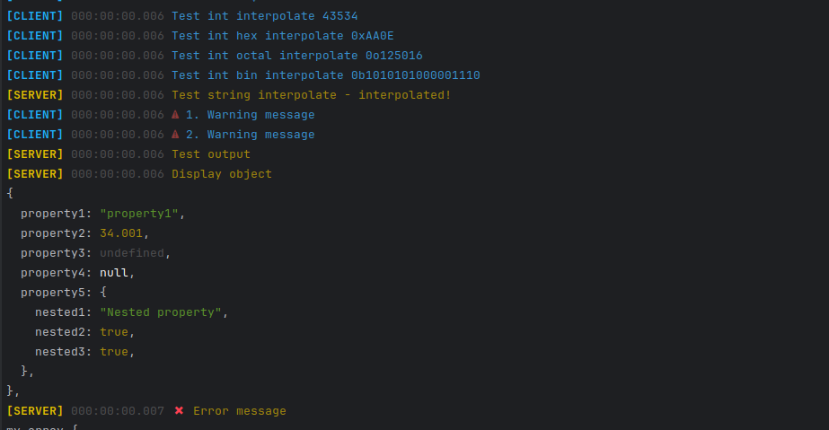

# Development Logger

Outputs logs of several running threads to one console, separating them in different colors. There is support for interpolation and output of javascript objects. Displays the time from the start of the service.




## Usage

```shell
npm install -D 
```